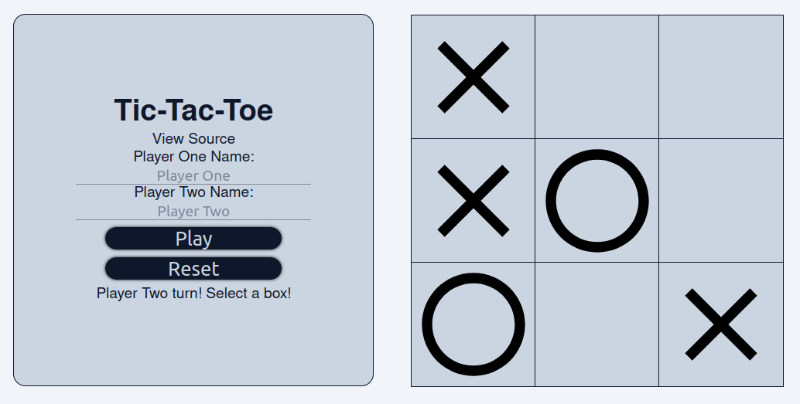

# Web Tic Tac Toe
2 player Tic Tac Toe played on the browser. Users are able to name themselves are use the default name. Players put their corresponding X or O on the board and try to get three in a row.  
The goal of this project was to practice using javascript factory functions and modules.  
Built using: 
* HTML
* CSS
* Javascript
### Live Demo:
[Live Demo](https://e-trinh.github.io/TicTacToe/)

